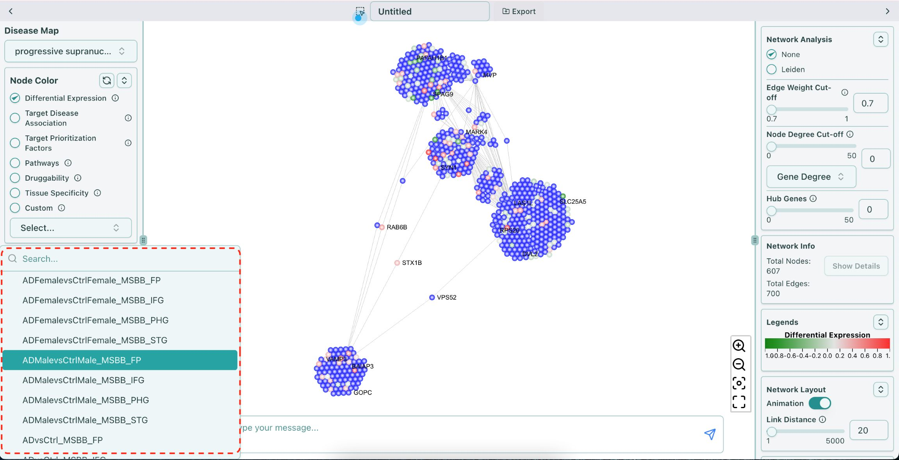
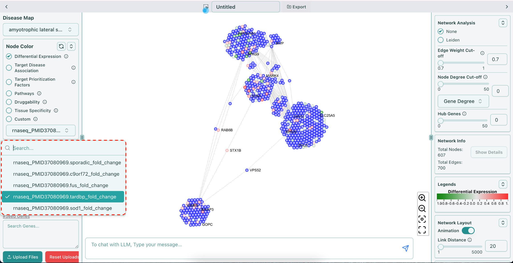

# Differential Expression

**Differential expression in Log2 fold change, value ranging from `-Inf` to `+Inf`**

Differential expression results for disease vs control are calculated based on transcriptomic and Proteomic data and is available from knowledge base in the form of log2-fold change.

> [!WARNING]
>
> **Disclaimer**: We include various different diseases for Differential Expression data, however, we don't provide the data for all diseases and it is encouraged to use Custom Upload to analyze the files.
> The data is available for PSP & ALS diseases only.

Let's go through them one by one.

## PSP

AD (Alzheimer’s Disease) data is available for Differential Expression data available in PSP disease.

The summary of AD data is listed below:

| Brain Bank | Description | Brain Region |
| --- | --- | --- |
| Mayo | Study of Alzheimer’s disease and related dementias on donors from the Mayo Clinic Brain Bank and Banner Health | Cerebellum (CBE), Temporal cortex (TCX) |
| ROSMAP | Two longitudinal studies of aging and Alzheimer’s disease with brain donation upon death - The Religious Order Study (ROS) and Memory and Aging Project (MAP) run by Rush Alzheimer’s Disease Center. | Dorsolateral prefrontal cortex (DLPFC), Posterior cingulate cortex (PCC), Anterior cingulate cortex (ACC) |
| MSBB | Study of Alzheimer’s disease on donors from the Mount Sinai/JJ Peters VA Medical Center NIH Brain and Tissue Repository | Frontal pole (FP), Inferior frontal gyrus (IFG), Parahippocampal gyrus (PHG), Prefrontal cortex (PFC), Superior temporal gyrus (STG) |

| Brain Bank | Brain Region | Contrasts | Annotation |
| --- | --- | --- | --- |
| Mayo | CBE, TCX | Diagnosis-tissue wise (AD Vs Control) | ADvsCtrl |
| MSBB | FP, IFG, PHG, PFC, STG | Diagnosis-tissue wise (AD Vs Control) | ADvsCtrl |
| MSBB | FP, IFG, PHG, PFC, STG | Diagnosis-tissue-gender (AD Vs Control) | ADFemalevsCtrlFemale, ADMalevsCtrlMale |
| ROSMAP | DLPFC, PCC,ACC | Diagnosis-tissue wise (AD Vs Control) | ADvsCtrl |
| ROSMAP | DLPFC, PCC,ACC | Diagnosis-tissue-gender-age of death (AD Vs Control) | ADFemalevsCtrlFemale_agedeath, ADMalevsCtrlMale_agedeath |

You can use the AD data to color or resize the nodes in the network. The name in the dropdown list of Differential Expression AD data follows the format of **\{contrast annotation}\_\{brain bank}\_\{brain region}**, for example, "ADvsCtrl\_MSBB\_FP", shown as below:

## ALS

The Differential Expression data of ALS is from [this paper](differential-expression.mdx#citation) [1]. According to the paper, to identify how ALS iPSMN changes compare between ALS genetic backgrounds, the effect of each genetic subgroup on gene expression is examined separately, including C9orf72 mutants, SOD1 mutants, FUS mutants,  TARDBP mutants and sporadic iPSMNs (without an identifiable ALS mutation).

You can use the ALS data to color or resize the nodes in the network. The name in the dropdown list of the data follows the format of **\{"rnaseq"}\_\{"PMID37080969."}\_\{mutant}\_\{"fold\_change"}**, for example, "rnaseq\_PMID37080969.tardbp\_fold\_change", shown as below:

## FTD

For Differential Expression data for FTD, we provide log-fold change between FTD patients vs control in Frontal Cortex Excitatory Neurons.

***

#### Citation

> _\[1] Ziff OJ, Neeves J, Mitchell J, Tyzack G, Martinez-Ruiz C, Luisier R, Chakrabarti AM, McGranahan N, Litchfield K, Boulton SJ, Al-Chalabi A, Kelly G, Humphrey J, Patani R. Integrated transcriptome landscape of ALS identifies genome instability linked to TDP-43 pathology. Nat Commun. 2023 Apr 20;14(1):2176. doi: [10.1038/s41467-023-37630-6](https://doi.org/10.1038/s41467-023-37630-6). PMID: 37080969; PMCID: PMC10119258._