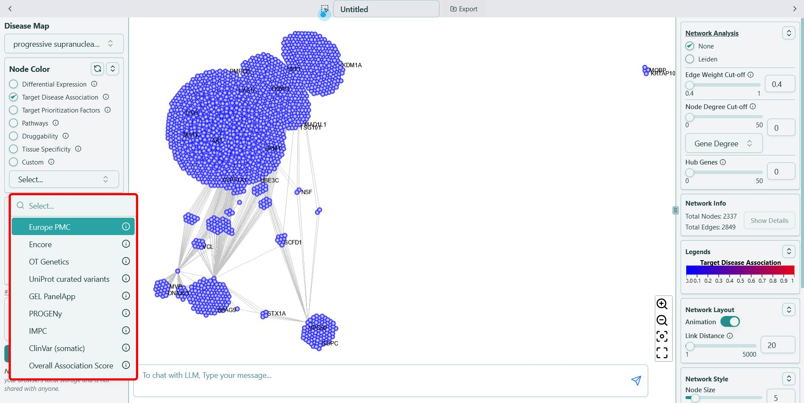

# Target Disease Association

**Target disease association scores from Open Targets Platform, value ranging from `0` to `1`**

The Open Targets Platform evaluates target-disease associations by aggregating diverse evidence types, such as genetic studies, clinical data, and scientific literature. Each unique target-disease pair is defined as an association, contextualizing all related information within the platform. To quantify the strength of these associations, the platform employs a scoring system that calculates a harmonic sum of evidence scores from various data sources, normalizing the result to ensure comparability. This approach provides a consensus view of the association's strength, aiding researchers in prioritizing targets for further investigation.

We use **\{evidence-type}** as the format, for example, “Europe PMC”, shown as below:

For more information on each of the sources of the target disease association scores, please refer to the [Open Targets Platform documentation](https://platform-docs.opentargets.org/evidence#evidence-data-sources).