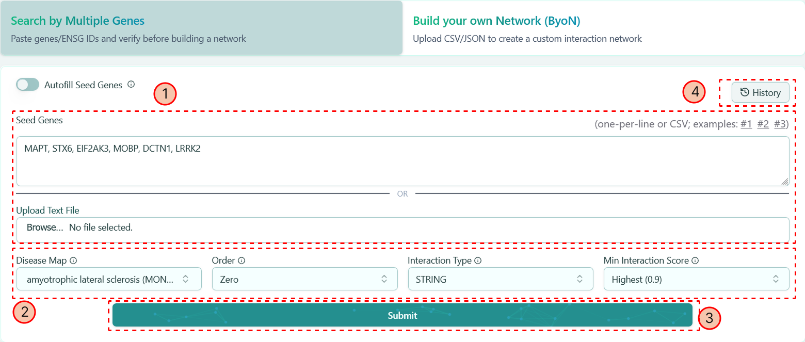

import { Steps, Image } from 'nextra/components'

# Search By Multiple Genes

**This approach is based on the interactions existing in our database**

When you enter the main page of our website, simply click the tab "Search By Multiple Genes" on the top panel, you will see the corresponding dashboard on the right as below:

There are 4 different sections on the dashboard, which corresponds to 4 steps to construct your network by using gene information. 

<Steps>
### Entering Seed Genes

You can enter seed genes with any of the following methods.&#x20;

* **Type into textbox**: Manually type in seed gene names or their Ensembl IDs to generate the network. You can also mix gene names and Ensembl IDs together. The format is line-separated.
* **Upload a txt file**: The gene names or Ensembl IDs can also be uploaded as txt format. The format is the same as the "Seed Genes" textbox.
* **Autofill Seed Genes**: Turn on the switch "Autofill Seed Genes" and enter the number of seed genes you want to include. The system will automatically populate the textbox ordered by Overall Association Score of that Gene with the selected Disease Name. This data is prepared from OpenTargets Portal.

The seed genes are the foundation of the network generation, your network will be expanded based on the seed genes you provided. Once you determine the seed genes, you may proceed to [`Step 3`](search-by-multiple-genes.mdx#clicking-submit-button) using the default options to generate your own network.

### Selecting Preferable Options

Now you can select different options from different parameters to integrate your own feature styles into your network. We offer 4 parameters here -- Disease Map, Order, Interaction Type and Min Interaction Score. Let's go through them one by one:

* **Disease Map**: You can determine your network falls into which disease category, and no worries, if you want to change the disease after generating the network, you can easily change it on the [left panel](../network-visualization/left-panel.mdx) of the network visualization page.&#x20;
* **Order**: Based on the seed genes you provided, you can expand the network from different perspective. We provide 3 different orders:
  * Zero order: This option only gives you the interactions among the seed genes.
  * First order: This option involves the neighbors of the seed genes. Besides the interactions among the seed genes in Zero order, it also gives the interactions among seed genes and their neighbors.
  * Second order: This option is a combination of First order and Zero order. It not only contains the interactions among seed genes themselves & the interactions among the seed genes and their neighbors, it also contains the interactions among the neighbors of seed genes.
* **Interaction Type**: We provide 3 different interaction types for you to construct your own network:
  * PPI: Protein-protein interactions.
  * IntAct: Molecular Interaction Database interactions.
  * BioGrid: Biological General Repository for Interaction Datasets interactions.
* **Min Interaction Score**: Each interaction has its own score, from computer science perspective, we also call it edge weight. You can select the cutoff here to make your network thinner or fatter. There are 4 different cutoff available: Low (0.15), Medium (0.4), High (0.7) and Highest (0.9).

### Clicking "Submit" Button

After click "Submit", a confirmation page will pop up. There are 2 tabs available in the pop-up window: **Found** and **Not-Found**.

* **Found**: The listed genes are available in our database, you can confirm the information of seed genes. You can also click on the link of each ENSG ID and Gene Name, which directs you to the corresponding Ensembl page and corresponding HGNC page, respectively.

* **Not-Found**: The listed genes have no records in our database. You probably entered a wrong name or wrong Ensembl ID, you mignt want to go back to the "Seed Genes" textbox or your uploaded file to make the corresponding changes and submit again. Or you can simply click "Submit" button and proceed to the [Network Visualization page](../network-visualization/).

You can also download the Found genes and/or Not-Found genes by clicking the download button <Image width={30} height={30} src="/image/docs/download-button.png" alt="Download" style={{ display: 'inline', aspectRatio: '1/1' }}/> on the Results Preview window.

### History

Once you generated your own network, you can find the record here and easily access that specific network again.
</Steps>

### Knowledge bot

Our tool delivers highly factual, concise, and precise answers to specific biomedical questions. You simply need to type your question in the knowledge bot below.&#x20;

As shown above, you can ask about genes involved in Parkinson’s disease, it directly lists the gene names, disease pathways, and interactions, avoiding generic or vague responses common in traditional models. Additionally, the tool includes a side feature of validating the answers with their corresponding citations, sourced from credible medical databases or web scraping. While citation validation is still under testing, future updates will enable the tool to recognize and include novel sources dynamically.&#x20;