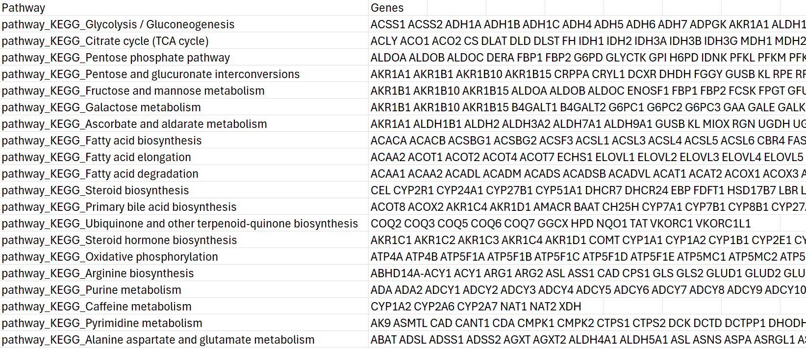
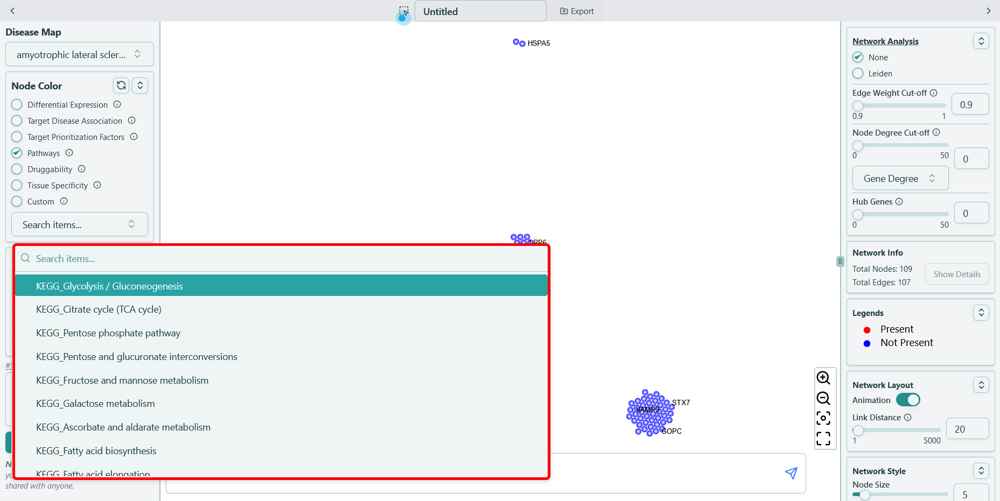

# Pathways

Each pathway contains different genes, and the original data looks like below:

{/*  */}

In Node Color section, when you click on a specific pathway name in the dropdown list of "Pathways" feature, you will see red colors rendered in the network, indicating the genes in the selected pathway. The name of each pathway follows the format of  **{"Pathway"}\_\{database name}\_\{pathway name}**, for example, "Pathway\_KEGG\_Endocytosis", shown as below:

