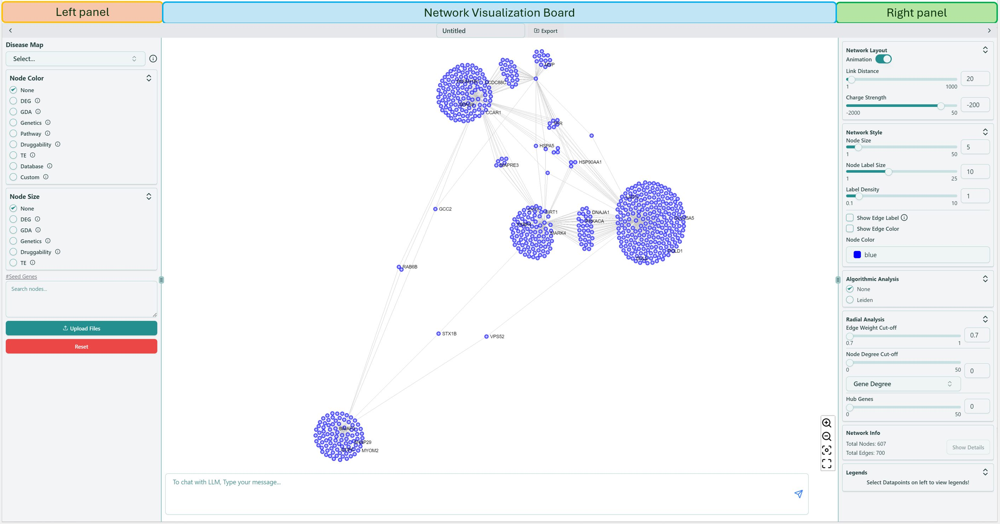

# Network Visualization

Right now you enter the network visualization page, shown as below, where you can analyze your network based on your selections on [Dashboard](dashboard.mdx).

### Gene information

If you **hover** on an arbitrary gene (node), you are able to see the corresponding gene information, and all the genes connected with this hovered gene are also highlighted. If you **click** on a specific gene, a small window will show up on the upper right corner, giving you the details related to this genes.

Network visualization page contains the [Left panel](network-visualization/left-panel.mdx), [Right panel](network-visualization/right-panel.mdx) and [Network visualization board](network-visualization/network-visualization-board.mdx). Left panel focuses on the functions related to basic analysis of the network, while Right panel focuses on the advanced analysis functions and modifications of inherent network parameters. Network visualization board provides the interactive operations for users to apply various analysis on the network.
